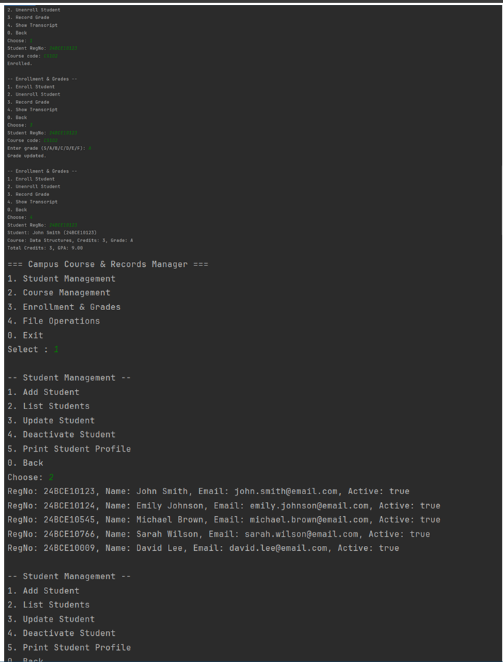
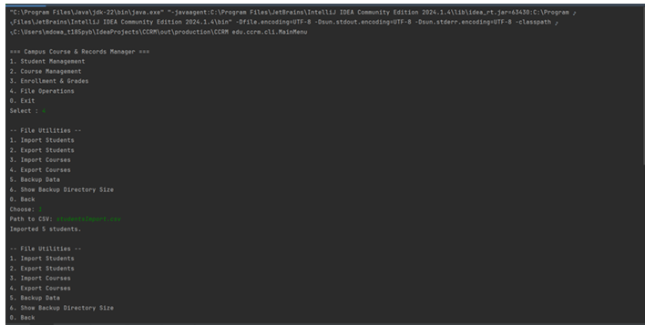
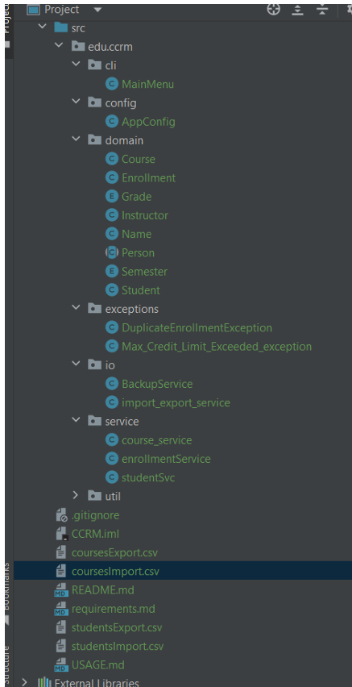
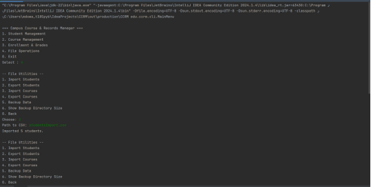
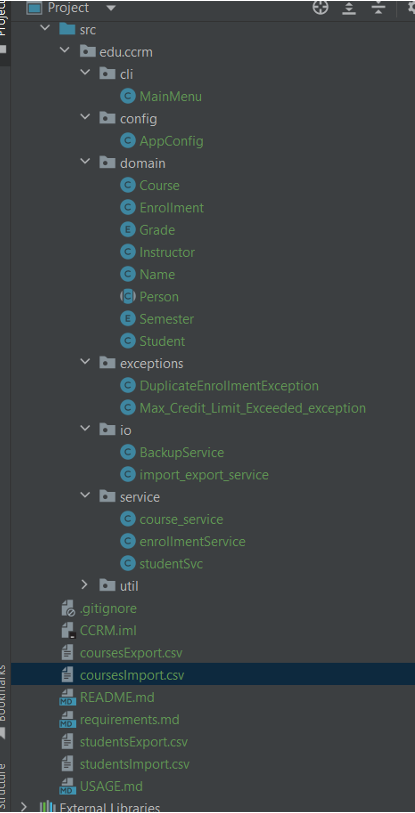

# Campus Course & Records Manager (CCRM)

## Project Description

Campus Academic Management System (CAMS) is a robust Java-based command-line application designed for efficient management of academic operations in educational institutions. The system provides comprehensive functionality for handling student records, course administration, enrollment processes, and academic reporting.

## Core Functionalities

- **Student  Management**: Complete CRUD operations for student profiles with enrollment tracking
- **Course Administration**: Manage course catalog, assignments, and scheduling
- **Academic Records**: Grade management, GPA calculation, and transcript generation
- **Data Operations**: Advanced file handling with CSV import/export and backup systems

All features use OOP, robust exception handling, Java NIO.2 for file operations, Date/Time API, Streams & lambdas, and classic/modern CLI programming.

## Evolution of Java (Timeline)

- **1995**: Java 1.0 released by Sun Microsystems
- **1998**: Java 2 Platform (J2SE, J2EE, J2ME) established
- **2006**: Sun open-sources Java (OpenJDK)
- **2014**: Oracle introduces regular release cycle (Java 8 and later)
- **2017**: Java 9+ introduces modules, JShell, var, streams, new Date/Time API
- **2021+**: Modern Java with records, pattern matching, enhanced JVM performance

## Java ME vs SE vs EE (Usage Comparison)

| Platform | Use Case | Libraries/Features |
|----------|----------|-------------------|
| Java ME | Mobile/embedded devices | Subset of SE; Optimized for limited hardware |
| Java SE | Desktop/CLI/server app | Full core libraries, Swing, NIO, Concurrency |
| Java EE | Enterprise/web servers | Servlets, JSP, JMS, EJB, JPA, large-scale |

## Java Architecture: JDK, JRE, JVM

- **JDK (Java Development Kit)**: Full development environment (compiler, tools, JRE)
- **JRE (Java Runtime Environment)**: JVM + core libraries for running Java programs
- **JVM (Java Virtual Machine)**: Executes Java bytecode, platform-independent

**Interaction:**
Source code (.java) → Compiled (.class) → Executed by JVM (within JRE, in JDK)

## Java/IDE Setup Instructions

### 1. Install Java 17+
- Download from AdoptOpenJDK
- Confirm install with:
```bash
java -version
```


### 2. Project Setup Open Eclipse IDE
- File → New → Java Project → Name: CCRM
- Set src as source folder, add package structure as described below
- File → New → Class → Main class: edu.ccrm.cli.MainMenu









> **Note:** This project was developed and tested using IntelliJ IDEA Community Edition. All screenshots and setup steps provided below show IntelliJ IDEA, but the project may also be run in Eclipse or any Java IDE.

## Build & Run

### CLI (Terminal) Instructions

1. Open terminal in the project root.
2. Compile:
```bash
javac -d out src/edu/ccrm/cli/MainMenu.java
```
3. Run:
```bash
java -cp out edu.ccrm.cli.MainMenu
```

Or use IntelliJ/Eclipse "Run" action on MainMenu.

## Folder & Package Structure

```
CCRM/
├── src/
│   └── edu/ccrm/
│       ├── cli/
│       ├── domain/
│       ├── service/
│       ├── io/
│       ├── util/
│       └── config/
├── students.csv
├── courses.csv
├── README.md
├── USAGE.md
└── requirements.md
```

## Features (Demo Flow)

- **AppConfig (Singleton)** loads configuration at start
- **Main menu:**
  - Students / Courses / Enrollment & Grades / File Operations / Backup / Reports / Exit
- All operations: switch-case, if-else, loops, break/continue, labeled jumps
- Reports: transcript, top students, GPA distribution (streams)
- File import/export, backup with NIO.2
- Print Java ME/SE/EE note (see above)

## Sample CSV Formats

### students.csv
```csv
regNo,fullName,email
2025001,John Smith,john.smith@email.com
2025002,Emily Johnson,emily.johnson@email.com
```

### courses.csv
```csv
code,title,credits,semester,department
CS101,Introduction to Programming,3,FALL,Computer Science
```

## Key Technical Concepts Demonstrated

- **Packages**: See src/edu/ccrm/…
- **OOP Pillars**: Encapsulation, inheritance, abstraction, and polymorphism in domain/service layers
- **Abstract classes & interfaces**: Person (abstract), Persistable/custom functional interface for search/filter
- **Enums**: Semester, Grade
- **Static nested & inner classes**: Course.Builder
- **Lambdas, streams, functional interfaces**: Sorting/filtering in services
- **Upcast/downcast/examples** with instanceof
- **Custom exceptions**: DuplicateEnrollmentException, MaxCreditLimitExceededException
- **Design Patterns**: Singleton (AppConfig), Builder (Course.Builder)
- **Assertions**: Used for invariants (enable with -ea)
- **NIO.2, Streams, Date/Time API** throughout
- **Recursion utility**: Directory scanner for backups

## Mapping Table: Requirement → Code Location

| Syllabus Topic | File/Class/Method |
|----------------|-------------------|
| Primitive/Operators/Decisions | MainMenu.java, service classes |
| Loops/Jumps | MainMenu.java |
| Arrays & Utilities | StudentService, CourseService |
| String Manipulation | ImportExportService |
| Encapsulation/Inheritance | Person, Student, Instructor |
| Abstraction/Polymorphism | Person, Transcript |
| Interfaces & Lambdas | service, util |
| Exception Handling/Custom Excep. | exceptions/, EnrollmentService |
| Patterns (Singleton/Builder) | config/AppConfig, Course.java |
| Streams & NIO, Date/Time | io/ImportExportService, util |
| Recursion | util/RecursionUtils |

## Enabling Assertions

To enable assertions:
```bash
java -ea -cp out edu.ccrm.cli.MainMenu
```

Sample usage: See checks in service/domain/utility classes.

## Screenshot






## Academic Integrity

- This project is individual work following VIT's honor code.
- See "Acknowledgements" for references, if any. All logic, documentation, and code are original unless cited.

## Contact

**Author**: PARIKRAMA GARGAV  
**Email**: parikramagargav@gmail.com  
**Institution**: VIT BHOPAL
